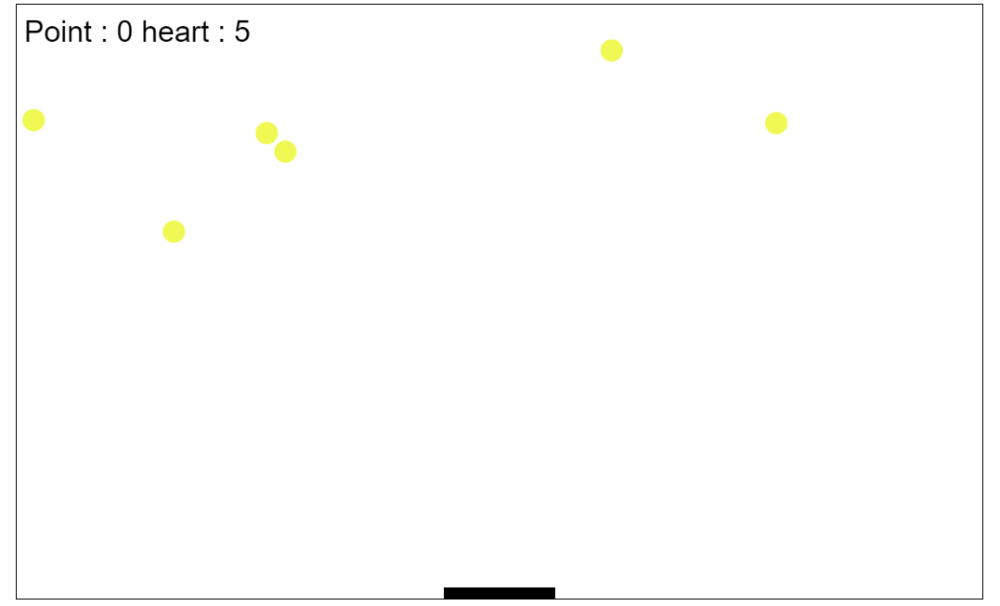
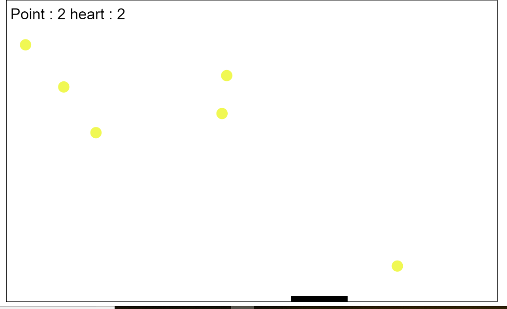

# pong bounce game

une simple implementation du jeu pong bounce developper avec canvas javascript

## Getting Started

### Prerequisites

Npm 
node.js

### Installing

installation du server  
$ npm install connect serve-static
$ node server.js

## Running the tests

  
  
  

## Authors

**Hatim Joubair** 

